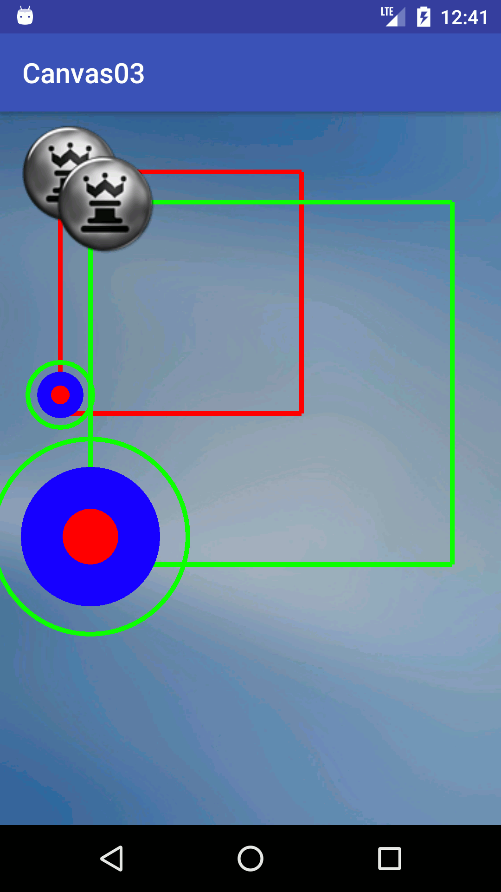

# DrawUsingAndroidCanvas

##### In this  folder there is a number of repos made by using canvas

## What is Canvas?
```
In android Canvas class is used to draw on the Screen.The Android framework provides a set of 
two-dimensional drawing APIs that allow you to render your own custom graphics onto a canvas or 
to modify existing views to customize their look and feel.  The Canvas class holds the "draw" calls. 
To draw something, you need 4 basic components.
```
* **4 basic components:** 
  - A Bitmap 
    > to hold the pixels 
  - A Canvas 
    > to host the draw calls (writing into the bitmap), 
  - A drawing primitive 
    >e.g. Rect, Path, text, Bitmap 
  - A paint 
    > to describe the colors and styles for the drawing. 
  ---
    
    | Canvas02 | Canvas03|
    |:--------:|:--------:|
    |  |  |
